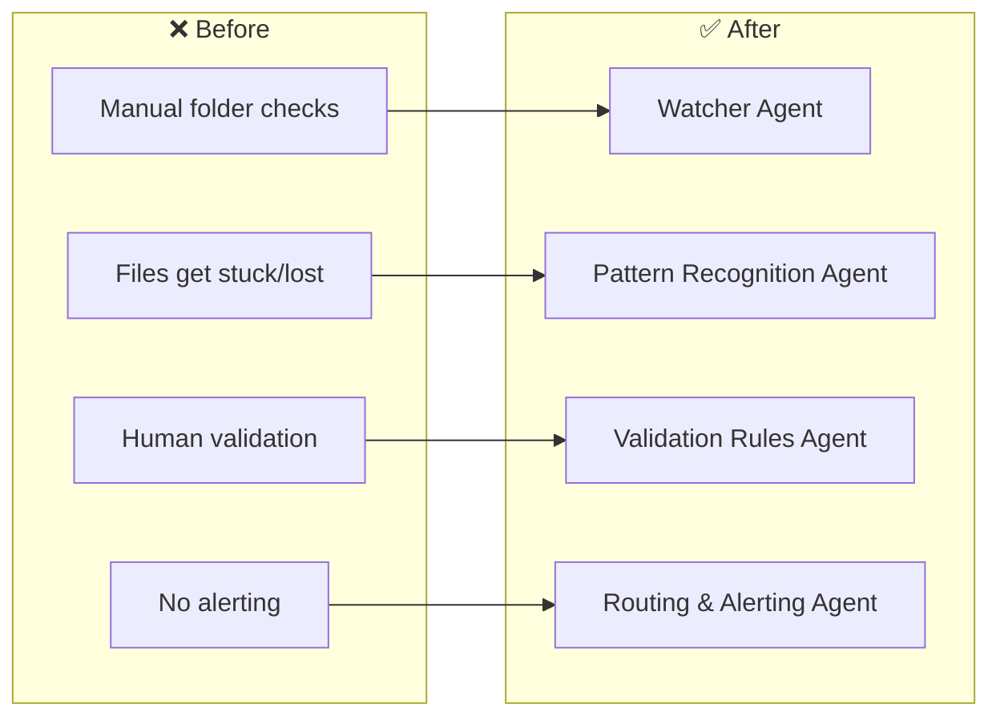
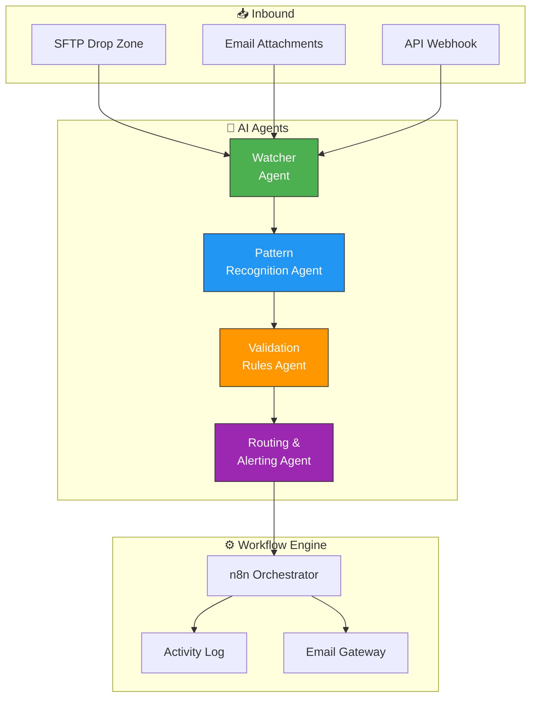

# 📂 Healthcare Data Operations — AI Agents for File Monitoring

> SPARKSPHEAR builds AI agents for healthcare data operations workflows across TPAs, payer organizations, clearinghouses, and healthcare data processing centers.

**Start With the Workflow. Scale What Works.**

We audit the system, connect the tools that fit, and automate the work that does not require constant manual attention.

---

## ❌ The Problem

TPAs and payer organizations process thousands of files daily — 834s, 837s, eligibility files, claims feeds. Staff manually check folders hourly, but files get stuck, naming conventions drift, and missed files mean missed SLAs. The operations team does everything — and the data pipeline plateaus.

**Before:** Manual hourly folder checks, stuck and lost files, human error, missed SLAs, staff burnout, no audit trail.

**After (AI Agent Fleet):** 24/7 autonomous monitoring with instant file detection, pattern recognition, validation routing, and email alerts for anomalies. Zero missed files, SLA compliance guaranteed.

---

## 🤖 AI Agent Fleet

Four AI agents that watch, validate, and route every file that enters your data pipeline.

### Architecture

### Answer and route
The agent handles approved file drops by identifying file type, validating format against configurable rules, and routing to the correct processing path. It captures the filename, pattern match, validation result, and destination — then sends the right processing path or alert.

### Bring clients back
Use file-type-specific return windows (daily 834 cutoff alerts, weekly 837 reconciliation reminders, monthly eligibility file audits) to flag processing gaps and prepare operations-approved escalation messages.

### Keep control
File rejection decisions, routing overrides, and SLA escalation thresholds stay behind permissions, escalation rules, and human review. The agent assists; you remain responsible.

---

## 🚀 Start With One Workflow

We do not start by selling the biggest package. We start by auditing the workflow and identifying the smallest useful agent.

**Workflow Audit — Starting at $297 one-time**
- Current workflow map
- Bottleneck analysis
- Existing-tool review
- Data and access requirements
- Agent suitability assessment
- Three prioritized automation opportunities
- Recommended first agent
- Implementation scope
- Measurement and acceptance plan

**Implementation — One-time build fee**
- Agent development and testing
- Approved integration setup
- Escalation rule configuration
- Acceptance criteria verification

**Monthly Agent Operation — Recurring package fee**

| Package | Price | Best For |
|---------|-------|----------|
| **SIGNAL START** | $297/mo | One narrow workflow, one primary channel, one or two approved integrations |
| **FLOW CONTROL** | $697/mo | Several related workflows with routing, follow-up, and exception handling |
| **SYSTEM LIFT** | $1,497/mo | Multiple workflows, channels, custom rules, and meaningful reporting |
| **SCALE CONTROL** | from $2,997/mo | Multi-location, operations-heavy, custom APIs and dashboards |

This maps to **FLOW CONTROL** — several related workflows (file monitoring, pattern matching, validation, alerting) with routing between agents and exception handling for unknown file types.

---

Built by **[Shazaly Musa](https://github.com/SparkSpheartech)** — Founder, SparkSphear Tech  
*Start With the Workflow. Scale What Works.*  
*AI Agents for Healthcare Data Operations*