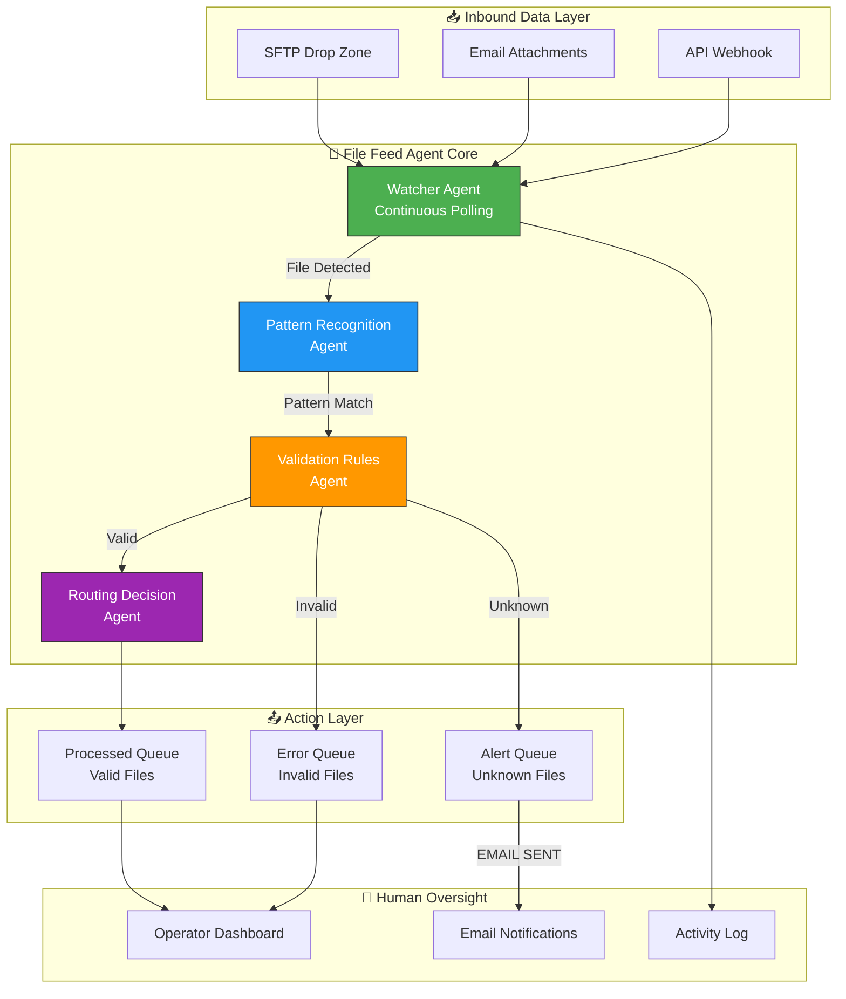
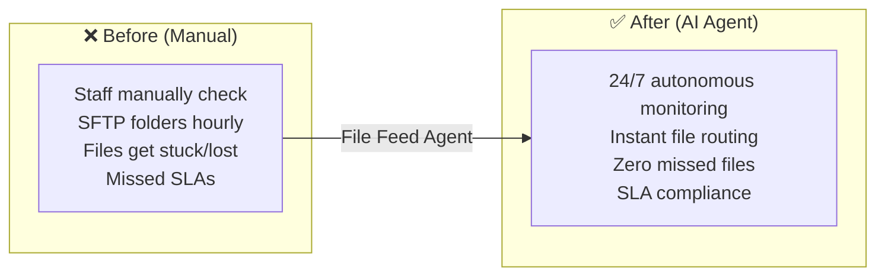

# 📂 File Feed Agent — AI-Powered Data Ingest Monitor

> **An autonomous AI monitoring agent that watches, validates, and routes data files**  
> Acts as the first line of defense for critical data pipelines.

---

## ❌ The Problem

In TPA/Payer environments, thousands of files arrive daily — 834s, 837s, eligibility files, claims feeds. Staff must manually check SFTP folders hourly, identify file types, validate formats, and route them for processing. Files get stuck in inboxes, naming conventions drift, and missed files mean missed SLAs, delayed claims, and compliance violations.

**Before:** Manual hourly folder checks, stuck/lost files, human error, missed SLAs, staff burnout.

**After (AI Agent):** 24/7 autonomous monitoring — instant file detection, pattern recognition, validation routing, and email alerts for anomalies. Zero missed files, SLA compliance guaranteed.

---

## 🧠 AI Agent Architecture



## 🤖 How the AI Agent Works

This is an **autonomous file monitoring agent** that never sleeps:

| Agent Component | Function |
|----------------|----------|
| **Watcher Agent** | Continuously polls input directories — zero-latency file detection |
| **Pattern Recognition Agent** | Uses `fnmatch` to match files against configurable glob patterns (CLAIMS_*.csv, ENROLL_*.csv) |
| **Validation Rules Agent** | Checks header integrity, file size thresholds, naming conventions |
| **Routing Decision Agent** | Moves valid files → `processed/`, invalid → `errors/`, unknown → alerts |
| **Alerting Agent** | Sends email-style notifications for anomalous file events |

## 🔄 Before vs After



## 🛠 Tech Stack

| Component | Technology | Agent Role |
|-----------|-----------|------------|
| **Core Logic** | Python 3.10+ | Agent brain |
| **Pattern Matching** | `fnmatch` | Recognition engine |
| **File Operations** | `shutil` | Atomic moves & routing |
| **Architecture** | Event-Loop (Daemon-ready) | Continuous operation |

## ⚡ Quick Start

```bash
# 1. Start the monitoring agent
python monitor.py
# Output: "Monitoring: ./input_feed"

# 2. Simulate file drops (in another terminal)
python test_feed.py

# 3. Check results
# Valid files → ./processed/
# Invalid files → ./errors/
# Alerts → activity.log
```

## 💡 Why This Matters

In TPA/Payer environments, thousands of files arrive daily (834s, 837s, Eligibility). A missing file can mean:
- Missed coverage enrollment
- Delayed claims processing
- Compliance violations

This AI agent acts as the **First Line of Defense** — ensuring no file is left stuck in an inbox.

---

Built by **[Shazaly Musa](https://github.com/SparkSpheartech)** — Founder, SparkSphear Tech  
*AI Agents for Healthcare Data Pipeline Automation*